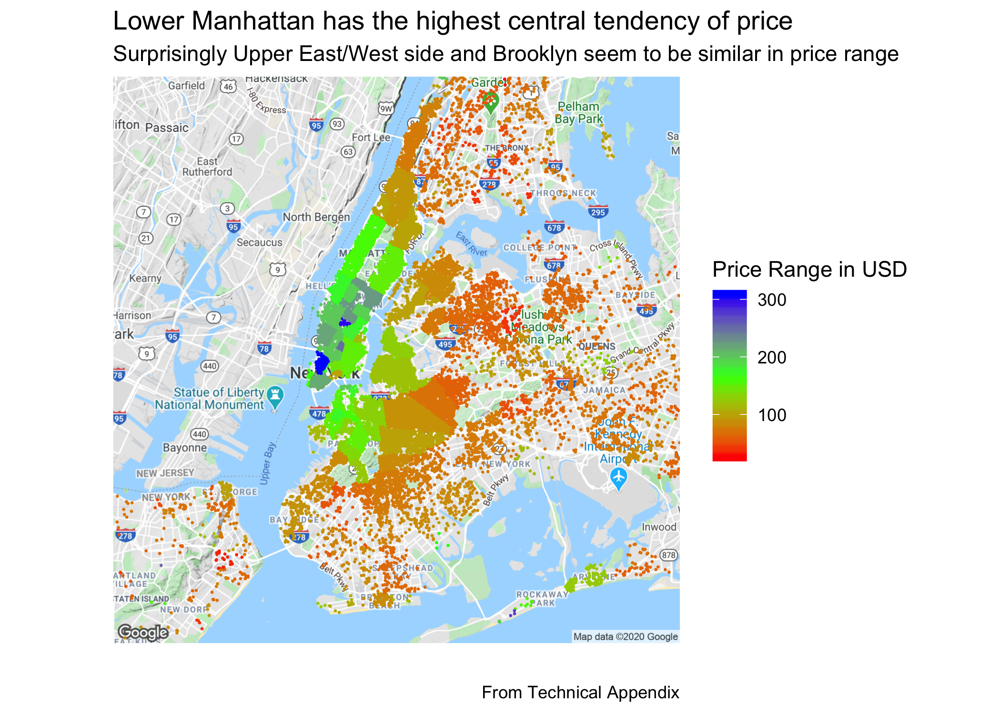
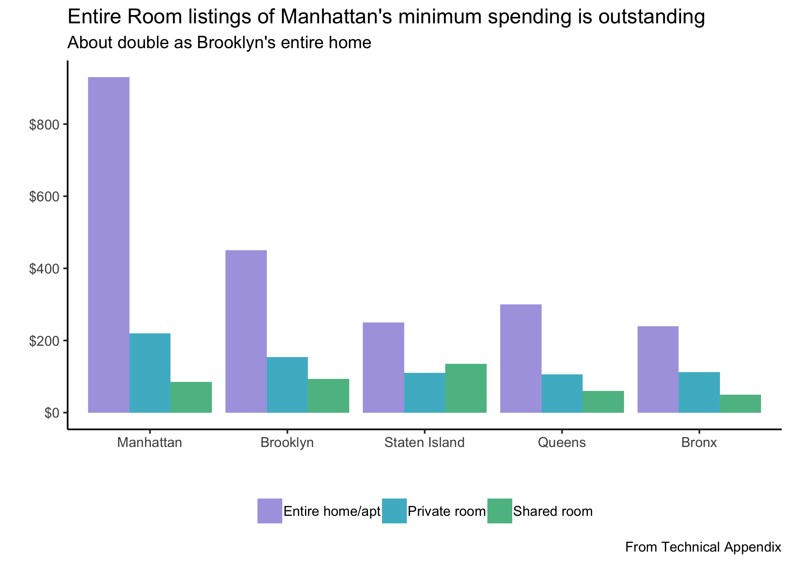

#### **To: My Manager at Mariott Hotel Group**  
  
#### **From: Akira Nakagawa**  
  
#### **Date: 12/12/2019**   
  
#### **RE: New York City AirBnB Analysis **  

***

Nowadays, competition with other hotels and non-traditional accomodation models like AirBnB. In this project, we analyzed AirBnB data in the most competitive area in the world, New York City. To keep up with the competition, it is important to know what major lodging service AirBnB is doing in the most competitive place in the United States. To accomplish our goal, we analyzed a sample AirBnB in NYC data with 31354 observations of listings. The data is a snapshot taken in 2019. Even though our business models are different, we see similarities and something unique about AirBnB that we can define what would be the segregation from AirBnB and our traditional hotel business model.
 
 

##### Finding 1 
Like our hotel industry, we found that listing prices in Manhattan, especially the Lower Manhattan area, is higher than other parts of New York City. For AirBnB, the neighbourhood's price range of Brooklyn (such as Williamsburg) and Upper East side, New York are almost the same price range. We can assume Brooklyn can be a popular place for people who want to do AirBnB and also potentially people who usually stay in the hotel.

{width=700px}
 
 

##### Finding 2
Also, we found that the minimum cost for staying in Manhattan is extremely high. This is because the central tendency of price is high in Manhattan as we see it in the graph above, and also many listings require customers to have more nights of stay than other boroughs. 
In other words,average minimum nights for AirBnB in Manhattan is more than 10 days. Our hotel and other hotel systems are more flexible in terms of days customers need to stay, so we should focus on those customers who need to visit Manhattan for a short term.

{width=500px}

In conclusion, we can say that we should try to invest on Brooklyn area because that's where we have not even consider before, and we should focus on short term-stay customers in Manhattan because that's what we can segregate from AirBnB.
 

Please do not hesitate to contact us if you have questions or would like to discuss the analysis further, it is best to reach us at anakagawa@seattleu.edu. We can also provide the Technical Appendix with our complete analysis and the data if you would like more detail.

Thank you,  
Best regards, 
Akira Nakagawa

